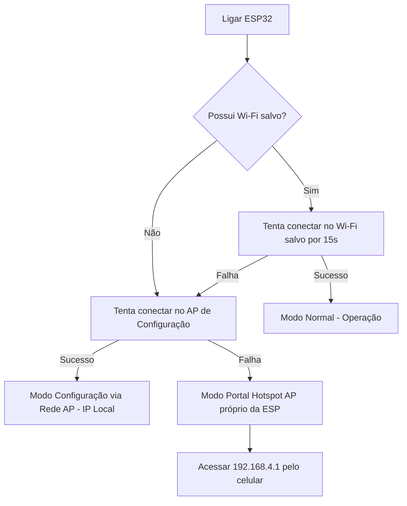

# 📟 Manual de Operação e Configuração - Ecossistema IoT SchoolGain

Este manual descreve a instalação, configuração e operação dos dois dispositivos baseados em ESP32 que integram o Totem Físico do **SchoolGain** (ambos utilizando o perfil de placa **ESP32 Dev Module** no Arduino IDE):
1. **ESP32-CAM (Câmeras)**: Transmissão de vídeo MJPEG e scanner de login por QR Code.
2. **Totem Controller (Controlador)**: Controlador físico do descarte (sensores sonares, RFID, servo-motores e motor da esteira).

---

## 📶 1. Fluxo de Inicialização e Conexão Wi-Fi

Ambos os dispositivos possuem uma lógica de inicialização inteligente em três etapas para garantir que você possa configurá-los em qualquer rede sem precisar reprogramar o firmware:



### Etapa 1: Conexão Principal (Wi-Fi Gravado no NVS)
O dispositivo carrega as credenciais salvas na memória Flash (`NVS Preferences`). Se existirem, tenta se conectar à rede escolar por **15 segundos**.

### Etapa 2: Conexão Fallback (Roteador de Configuração Portátil)
Se não houver credenciais salvas ou se a conexão escolar falhar, o dispositivo tenta se conectar automaticamente ao seu ponto de acesso portátil:
*   **SSID (Rede)**: `SchoolGain_Config_Net`
*   **Senha**: `schoolgain_config_wpa2`
> 💡 *Dica:* Você pode configurar o ponto de acesso portátil do seu celular com estes dados. A placa se conectará a ele, exibirá o IP no monitor serial e você poderá configurá-la de forma 100% prática pelo navegador (sem precisar conectar no Wi-Fi interno dela).

### Etapa 3: Portal Hotspot Próprio (Último Recurso)
Se ambas as tentativas falharem, a placa criará uma rede Wi-Fi local própria em modo *Access Point*:
*   **Nome do Wi-Fi (SSID)**: `SchoolGain_Cam_XXXXXX` ou `SchoolGain_Totem_XXXXXX` (onde `XXXXXX` são os últimos 6 caracteres do MAC Address).
*   **IP do Portal**: `http://192.168.4.1`

---

## 🔒 2. Portal Web de Configuração (IP Físico ou Hotspot)

Ao acessar o IP do dispositivo na rede ou `http://192.168.4.1` no modo Hotspot:

1.  **Tela de Login**:
    *   O acesso ao portal é protegido por senha.
    *   **Senha padrão de fábrica**: `schoolgain`
    *   O login gera um Cookie de sessão válido por 1 hora no seu navegador.
2.  **Formulário de Configuração**:
    *   **Wi-Fi SSID & Senha**: Dados da rede Wi-Fi da escola.
    *   **Servidor**: Endereço IP e porta da máquina local do totem (ex: `192.168.1.100:3000`) ou o domínio de produção (ex: `schoolgain.cetiapicella.com.br`).
    *   **ID do Terminal**: Identificador gerado para o totem na área administrativa do SchoolGain.
    *   **Token de Hardware**: Chave secreta de autenticação do hardware (`sg_hardware_secret_2026`).
    *   **Nova Senha do Portal**: Permite alterar a senha padrão de acesso à interface Web.
3.  **Ações Remotas via Rede**:
    *   **Reiniciar**: Envia comando para reinicialização de hardware (`ESP.restart()`).
    *   **Limpar Wi-Fi**: Limpa todas as configurações salvas no NVS e força a placa a reiniciar em modo de AP de Configuração.

---

## 💻 3. Recuperação e Reset via Cabo USB (Serial)

Se você esquecer a senha do portal ou precisar limpar as configurações fisicamente:
1.  Conecte o dispositivo ao computador via cabo USB (ou conversor USB-TTL para a ESP32-CAM).
2.  Abra o **Monitor Serial** (no Arduino IDE ou VS Code).
3.  Defina o Baud Rate para **`115200`** e selecione a opção de envio com "Nova Linha (NL)".
4.  Envie o comando:
    ```text
    RESET
    ```
    ou
    ```text
    CONFIG
    ```
5.  A placa exibirá a mensagem `[SYSTEM] Comando RESET recebido. Apagando configuracoes e reiniciando...`, limpará toda a memória flash e reiniciará com as configurações de fábrica (senha volta a ser `schoolgain`).

---

## 🔌 4. Mapeamento de Pinos e Conexões Físicas

### ESP32-CAM (Câmera)
*   **Flash LED Traseiro**: `GPIO 4`
*   **LED de Status Interno (Vermelho)**: `GPIO 33` (Ativo em nível baixo `LOW`)
*   **Pinos da Câmera OV2640**: Pré-configurados no arquivo `espcam.ino`.
*   **Baud Rate Serial**: `115200`

### Totem Controller (ESP32 Dev Module)
*   **Leitor RFID (MFRC522)**:
    *   `SDA` (SS) -> `GPIO 5`
    *   `SCK` -> `GPIO 18`
    *   `MOSI` -> `GPIO 23`
    *   `MISO` -> `GPIO 19`
    *   `RST` -> `GPIO 4`
*   **Ponte H (Motor da Esteira)**:
    *   `Motor 1` -> `GPIO 21`
    *   `Motor 2` -> `GPIO 22`
*   **Buzzer de Alerta**: `GPIO 15`
*   **Servos (MG995 - Comportas de Triagem)**:
    *   `Plástico` -> `GPIO 26`
    *   `Papel` -> `GPIO 27`
    *   `Vidro` -> `GPIO 14`
    *   `Metal` -> `GPIO 12`
*   **Sonares Ultrassônicos (HC-SR04)**:
    *   `Trig Lado Esquerdo` (Lixeiras Plástico/Papel) -> `GPIO 25`
    *   `Trig Lado Direito` (Lixeiras Vidro/Metal) -> `GPIO 2`
    *   `Echo Lixeira Plástico` -> `GPIO 32`
    *   `Echo Lixeira Papel` -> `GPIO 33`
    *   `Echo Lixeira Vidro` -> `GPIO 17`
    *   `Echo Lixeira Metal` -> `GPIO 16`

---

## 🛠️ 5. Diagnóstico de Rede e Integração com Proxy local

*   **Mixed Content / HTTPS**: Navegadores modernos em conexões seguras HTTPS (como o painel do SchoolGain) bloqueiam acessos diretos a IPs locais (`http://192.168.x.x`). Para evitar isso, configure o Totem no painel para usar **ESP32-CAM HTTPS Proxy**.
*   **Funcionamento do Proxy**: O script `scripts/camera-secure-proxy.js` rodará localmente na escola e receberá as conexões do painel pela porta `9005`. Ele traduzirá o MAC Address do dispositivo para o IP local dinâmico consultando o cache ARP e as tabelas UDP, contornando bloqueios de CORS e segurança do navegador.
*   **Reconhecimento Online/Offline**:
    *   A câmera está online se responder na porta `80` ou estiver recente nos logs.
    *   O controlador de descarte (que não roda servidor de stream) é identificado como online pelo proxy local se enviar telemetria à porta `9006` (UDP) ou se responder à porta local com `ECONNREFUSED` (provando que o chip está ligado e pingável na rede física).
